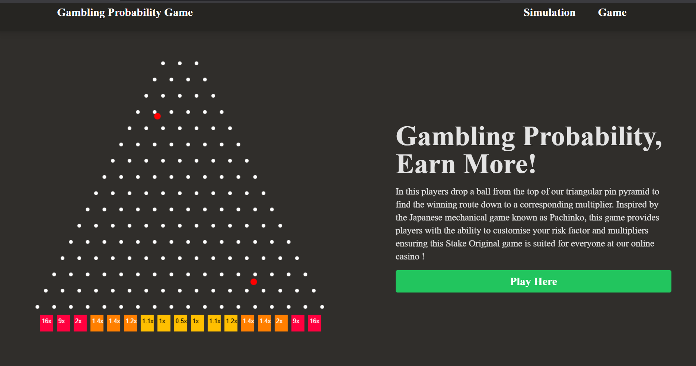
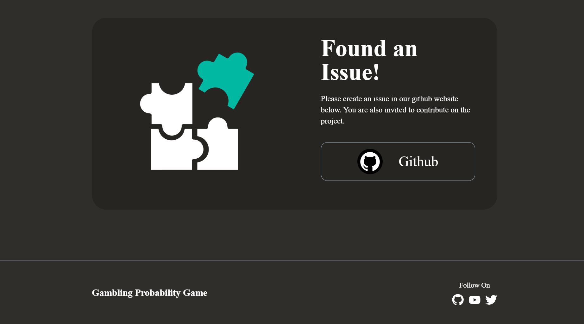
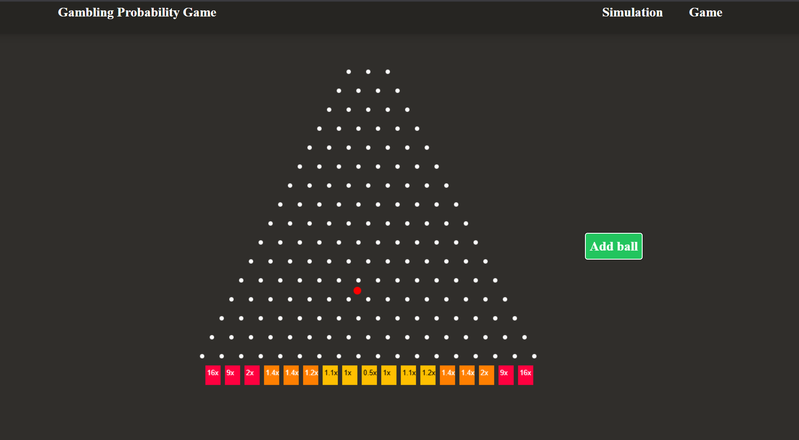
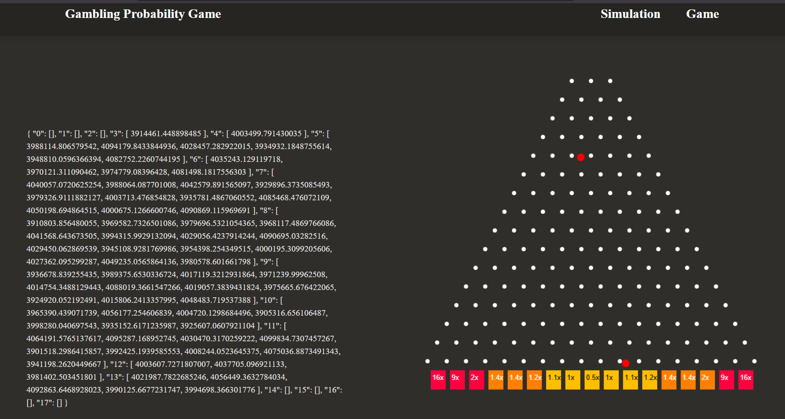

# 🎰 Gambling Probability Game

A simulation-based gambling game where outcomes and multipliers are handled securely on the backend. Built with React, Express, and TypeScript.

---

## 📸 Screenshots

### 🎮 Game Interface





### 📊 Result Panel


---

## ⚙️ Setup Instructions

Follow these steps to set up and run the project locally:

1. **Clone the project**
   ```bash
   git clone <your-repo-url>
   cd Gambling-Probability-Game
Install TypeScript

bash
Copy
Edit
npm install -g typescript
# or (if you prefer local installation)
npm install --save-dev typescript
Install Backend Dependencies

bash
Copy
Edit
cd backend
npm install
Install Frontend Dependencies

bash
Copy
Edit
cd ../frontend
npm install
Run the Backend

bash
Copy
Edit
cd ../backend
npm run build
npm start
Run the Frontend

bash
Copy
Edit
cd ../frontend
npm run dev
🚀 Running the App
🖥️ Backend: http://localhost:3000

🌐 Frontend: http://localhost:5173

Make sure both servers are running simultaneously in separate terminals.
